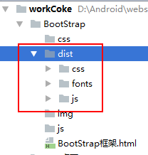
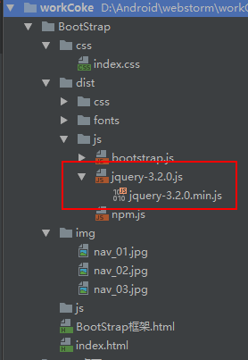
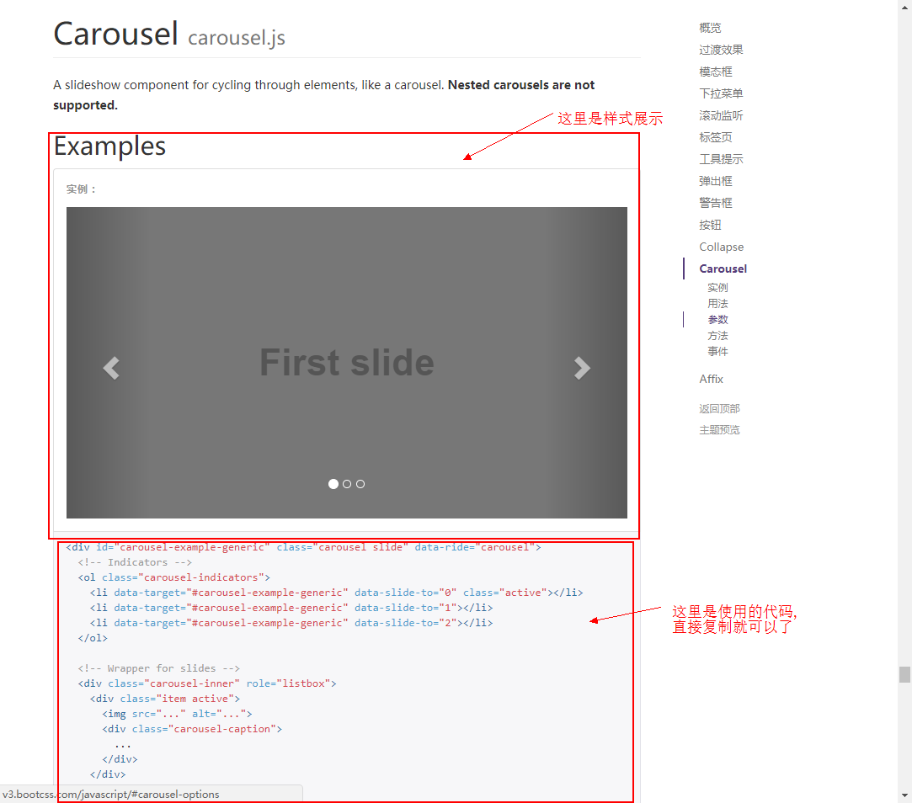

# BootStrap

## 1.什么是BootStrap

[Bootstrap](http://www.bootcss.com/)是最受欢迎的 HTML、CSS 和 JS 框架，用于开发响应式布局、移动设备优先的 WEB 项目

利用BootStrap可以快速构建HTML项目

参考官网: http://www.bootcss.com/

## 2. BootStrap的使用

### 2.1 使用前准备

- 从BootStrap官网下载BootStrap框架文件


下载完以后直接复制到自己的项目下,文件里面包含一些css样式,图标样式,js文件等




- 因为BootStrap里有的组件是与JQuery配合使用的,所以必须同时下载JQuery才能使用.

  官网地址:https://jquery.com/

  

  把下载的文件放进项目里

  

  ​

### 2.2 开始使用

#### 2.2.1 引用文件

```
<!DOCTYPE html>
<html lang="en">
<head>
    <meta charset="UTF-8">
    <title>Title</title>

    <!--引用BootStrap里的css文件-->
    <link rel="stylesheet" href="dist/css/bootstrap.css">

    <!--引用自己定义的css文件,一定要写在bootStrap后面-->
    <link rel="stylesheet" href="css/index.css">

</head>
<body>

    <!--引用jquery文件-->
    <script src="dist/js/jquery-3.2.0.js"></script>
    <script src="dist/js/bootstrap.js"></script>
</body>
</html>
```

#### 2.2.2 参考官网上的说明进行使用

例子:使用JavaScript中Carousel(广告轮播)

- 进入官网,选中红框的地方

  

- 复制代码

  

- 粘贴代码并按照自己的要求进行修改

  ```
  <div id="carousel-example-generic" class="carousel slide" data-ride="carousel">
      <!-- 指示器 -->
      <ol class="carousel-indicators">
          <li data-target="#carousel-example-generic" data-slide-to="0" class="active"></li>
          <li data-target="#carousel-example-generic" data-slide-to="1"></li>
          <li data-target="#carousel-example-generic" data-slide-to="2"></li>
      </ol>

      <!-- 广告页面 -->
      <div class="carousel-inner" role="listbox">
          <div class="item active">
              <!--换成自己的图片地址-->
              
              <div class="carousel-caption">
              </div>
          </div>
          <div class="item">
              
              <div class="carousel-caption">
              </div>
          </div>
          <div class="item">
              
              <div class="carousel-caption">
              </div>
          </div>

      </div>

      <!-- 上一张下一张按钮 -->
      <a class="left carousel-control" href="#carousel-example-generic" role="button"
         data-slide="prev">
          <span class="glyphicon glyphicon-chevron-left" aria-hidden="true"></span>
          <span class="sr-only">Previous</span>
      </a>
      <a class="right carousel-control" href="#carousel-example-generic" role="button"
         data-slide="next">
          <span class="glyphicon glyphicon-chevron-right" aria-hidden="true"></span>
          <span class="sr-only">Next</span>
      </a>
  </div>
  ```

- 完成

  

- 而且使用BootStrap已经帮你做好了适配处理,不需要自己去适配,