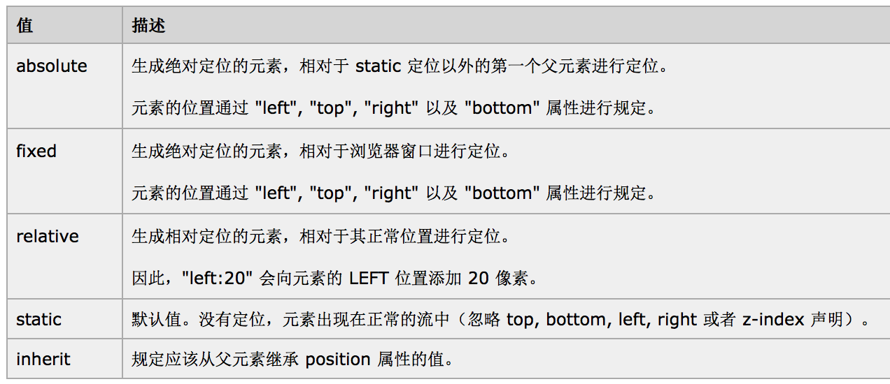

# CSS样式

## 概述

CSS的全称是Cascading Style Sheets,  层叠样式表

它是用来控制HTML标签的样式,负责美化网页.


## 1.编写格式

使用键值对形式

```
<!-- 单值  -->
color: red;
background-color: blue;
font-size: 20px;

<!-- 复合值  -->
border:3px solid red;
```


## 2.CSS的3种书写形式

### 2.1 行内样式 

直接在标签里style属性中写

### 2.2 页内样式 

 在该页面的style标签中写.style标签一般是写在head标签中

### 2.3 外部样式  

在一个单独的CSS文件中写,然后用link标签引用.


## 3.选择器

- 标签选择器   根据标签名找到标签,并添加样式  e.g. :div{}

- 类选择器  根据类名找到标签   .类名{}     e.g.  .high{}

- id选择器  根据标签中的id找打标签     #id名{}  e.g. #first{}

- 并列选择器   为多个标签添加样式   e.g. div,.high{}

- 复合选择器  根据指定标签中的类名找到标签 e.g. div.high{}

- 后代选择器  找到指定标签中所有指定的子标签    e.g. div p{}

- 直接后代选择器  找到指定标签中指定的直接子标签  e.g. div > p {}

- 相邻兄弟选择器  根据指定标签中找到相邻的标签 (不会找子标签)   e.g.  div + p{}

- 属性选择器  根据标签中指定的属性找到标签  e.g. div[name]{}

- 伪类选择器  为某个标签添加伪类选择器   选择器:属性{}  e.g.  xxx:focus{}

  

- 伪元素选择器  添加伪元素选择器,  选择器:属性{}  e.g.   xxx:first-letter{}

  


## 4.选择器的优先级别

- 同一个级别选择器的针对性越强,他的优先级就越高

  [[行内样式  >  页内样式  |  外部样式 ]()]()

  [[页内样式  与  外部样式  的优先级别是：层叠原则和就近原则]()]()

- **不同级别**选择器的权值越大优先级越高

   [通配选择符]()（*）：	0

  [标签]()： 				1

  [类]()： 				10

  [属性]()： 				10

  [伪类]()：				10

  [伪元素]()：				10

  [id]()： 				100

  [important]()： 			1000

  [复合选着器]():  权值=等于各个权值相加

- 优先级排序

important（1000） > 行内样式（999）> id > 类 > 标签 | 伪类 | 属性选择 |伪元素 > 通配符 > 继承


## 5.CSS标签中的属性

### 5.1可继承属性: 

父标签的属性值会传递给子标签,一般是文字控制属性

- **所有标签**可继承父亲下面属性：[visibility、cursor]()

- **内联标签**可继承父亲下面属性：

  letter-spacing、word-spacing、white-space、[line-height、color、font、font-family、font-size]()、font-style、font-variant、[font-weight、text-decoration]()、text-transform、direction 


- **块级标签**可继承父亲下面属性：

  [text-indent、text-align]()

- **列表标签**可继承父亲下面属性：

  [list-style]()、list-style-type、list-style-position、list-style-image

### 5.2不可继承属性: 

父标签的属性值不能传递给子标签,一般是区域控制属性

- [display、margin、border、padding、background、background-size]()
- [height、min-height、max-height、width、min-width、max-width]()
- [overflow、position、left、right、top、bottom、z-index]()
- [float、clear]()
- table-layout、vertical-align
- page-break-after、page-bread-before
- unicode-bidi


## 6.CSS3新增特性

- **RGBA透明度**  

  ​ RGB(红色R+绿色G+蓝色B),`RGBA`则在其基础上增加了Alpha通道，可用于设置透明值(0 - 1)块

- **阴影**   `box-shadow  text-shadow`

- **圆角**      `border-radius`


- **边框图片**     border-image


- **动画**   transform:

  -webkit-transition  过度效果

  -webkit-transform-origin   参照坐标

  -webkit-transform   动画效果


## 7.CSS布局

- 在默认情况下,标签都是在标准流布局中:

从上到下,从左到右

- 脱离标准流的方法有:

  float 属性:让指定的标签浮动到父标签的左边 -left或者右边 -right

  position 属性 和 left、right、top、bottom   属性值

### 7.1 Float 浮动属性

**Float:**

​	可以指定的子标签浮动在父标签的左边和右边.(一旦脱离标准流,标签类型就会变成行内-块级标签)

**Float：** 属性的常用值有

- **left**：`脱离标准流`，浮动在父标签的最左边


- **right**：`脱离标准流`，浮动在父标签的最右边

###  7.2 Position 定位属性

**属性值:**



要使用定位属性,首先要改变父布局的属性.


### 7.3 标签的居中

- **水平居中**

  - **行内标签**和**行内-块级标签**水平居中

    在父标签中设计：`text-align:center; `   属性。是对**整个标签**水平居中

  - **块级标签**水平居中

    1.在父亲标签中设计：text-align:center; 属性。  只是对标签中的**内容（文字..）**水平居中

    2.在自身标签中设计：`margin : 0px auto ;  `  属性。是对**整个块级标签**水平居中

- **垂直居中**

  - **行内标签**和**行内-块级标签**垂直居中

    在父标签中设计：`line-heigth:xx px; `  属性。是对**整个标签**水平居中

  - **块级标签**垂直居中

     1.在父亲标签中设计：`line-heigth:xx px;`  属性。 仅仅使**文字** 在**父标签**垂直居中

    2.在自己标签中设计：`line-heigth:xx px;  `  属性。 仅仅使**文字**在**自己标签**垂直居中

    **3.定位**

    ​	1.`子绝父相`  ; 

    ​	2.在子标签中设计相对`left:50%  ; top:50% ;` ; 

    ​	3.对子标签进行平移`transform:translate(-50% , -50%)`

  ​