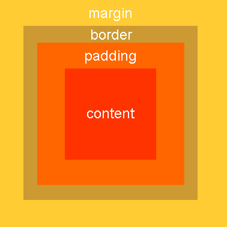
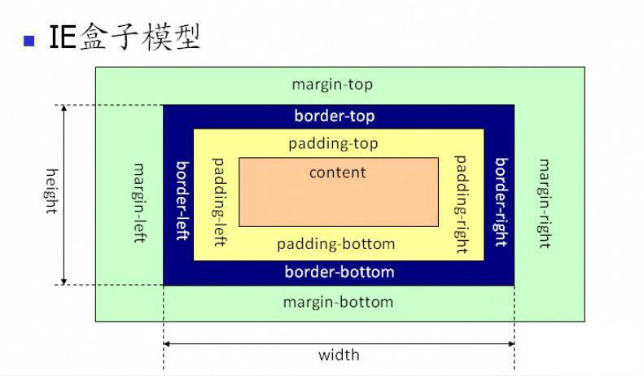
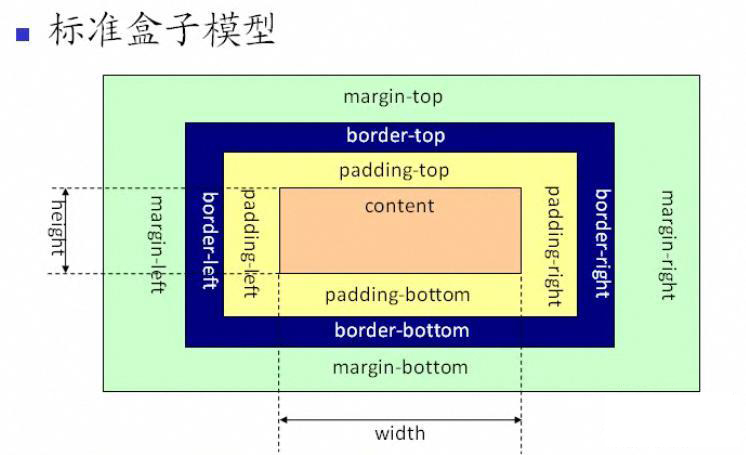
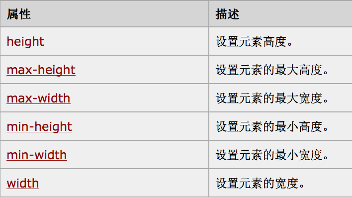
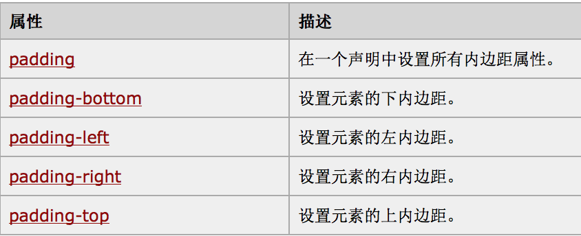
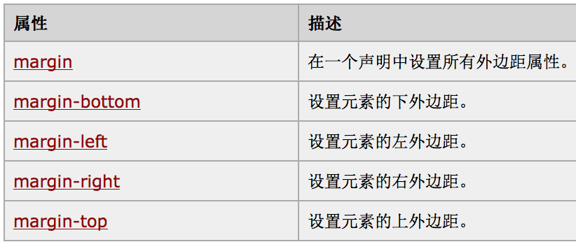

# 盒子模型

## 1.盒子模型

网页上每一个标签都是一个盒子.

每个盒子有四个属性:

- **内容（content）**

- **填充（padding，内边距）**

- **边框（border）：**

- **边界（margin，外边距）**

  ​

## 2.盒子模型的种类 

### 2.1 IE盒子模型

**结论：**

- 默认`盒子的大小=内容+填充+边框`

### 2.2 标准盒子模型

**结论：**

- 默认`盒子的大小=内容`   (  默认的box-sizing : content-box )

### 2.3 手动修改盒子计算标准

由于有两种不同的盒子模型,有时候需要适配不同的浏览器,所以需要手动指定盒子大小的计算标准:

盒子大小统一使用：`盒子大小=内容+填充+边框`  

标准盒子模型的解决方法：改 盒子`box-sizing` 的值

1.box-sizing  默认值为content-box , [盒子的大小=内容]()

2.将box-sizing设计为‘border-box’, [盒子的大小=内容+填充+边框]()

## 3.盒子CSS属性

### 3.1 控制内容

### 3.2 控制填充

### 3..3 控制边框

- **border**:  设计边框的width，style，color
- **border-width**
- **border-style**
- **border-color**

### 3.4 控制边界

